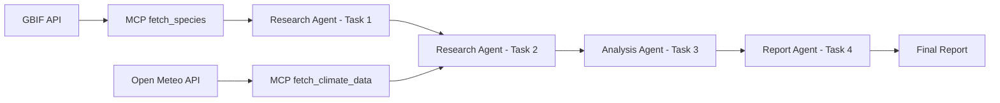

# Design Document

## Overview

The Wildlife Insight Agent is a Python application that implements a multi-agent system using the CrewAI framework and Model Context Protocol (MCP) to automate wildlife species and climate research and reporting. The system follows a pipeline architecture where three specialized AI agents work sequentially to fetch, analyze, and report on biodiversity data from the GBIF API and climate data from weather APIs using standardized MCP tools.

## Architecture

The system follows a linear pipeline architecture with four main tasks and MCP tool integration:



### Core Components

1. **CrewAI Framework**: Orchestrates the multi-agent workflow
2. **MCP Tools**: Standardized protocol tools for external API communication
3. **Agent Pipeline**: Sequential execution of specialized agents across four tasks
4. **Data Flow**: Context passing between tasks
5. **External APIs**: GBIF for species data, Open Meteo for climate data

## Components and Interfaces

### 1. Main Application (`main.py`)

**Purpose**: Entry point and orchestration of the CrewAI pipeline with MCP tool registration

**Key Functions**:
- MCP tool registration for fetch_species and fetch_climate_data
- `main()`: Initializes agents, tasks, and executes the crew
- Agent and task configuration

**Dependencies**:
- `crewai` for agent framework
- `mcp` for Model Context Protocol
- Tool imports from tools/ directory

### 2. MCP Tools Directory (`tools/`)

**Purpose**: Contains modular MCP tool implementations

#### 2.1 Species Tool (`tools/species_tool.py`)
- `fetch_species(species_name: str) -> dict`: MCP tool for GBIF API calls
- Handles species data retrieval and error management

#### 2.2 Climate Tool (`tools/climate_tool.py`)
- `fetch_climate_data(location: str) -> dict`: MCP tool for climate API calls
- Handles weather/climate data retrieval from Open Meteo API

### 3. Research Agent

**Configuration**:
- Role: "Wildlife Researcher"
- Goal: "Fetch data using MCP tools"
- Backstory: "Expert in biodiversity and climate datasets"

**Responsibilities**:
- Execute Task 1: Call fetch_species MCP tool with "tiger"
- Execute Task 2: Call fetch_climate_data MCP tool with "New York"
- Handle MCP tool responses and error cases
- Pass raw species and climate data to the analysis agent

### 4. Analysis Agent

**Configuration**:
- Role: "Data Analyst"
- Goal: "Analyze fetched species and climate data"
- Backstory: "Skilled at finding endangered species and environmental patterns"

**Responsibilities**:
- Execute Task 3: Combine results from Task 1 and Task 2 into insights
- Process raw GBIF API response data and climate information
- Extract occurrence counts, distribution information, and temperature patterns
- Identify conservation status indicators and climate correlations
- Generate structured insights for reporting

### 5. Report Agent

**Configuration**:
- Role: "Report Writer"
- Goal: "Summarize the insights in beginner-friendly language"
- Backstory: "Writes reports for students and conservationists"

**Responsibilities**:
- Execute Task 4: Write a beginner-friendly report with species and climate insights
- Transform technical analysis into accessible language
- Create structured, readable reports combining species and environmental data
- Focus on educational and conservation value with climate context

## Data Models

### API Response Structure
```python
# GBIF API Response (simplified)
{
    "results": [
        {
            "key": int,
            "scientificName": str,
            "canonicalName": str,
            "rank": str,
            "status": str,
            "confidence": int,
            "kingdom": str,
            "phylum": str,
            "class": str,
            "order": str,
            "family": str,
            "genus": str
        }
    ],
    "count": int,
    "endOfRecords": bool
}
```

### Task Context Flow
```python
# Task 1 Output (Research Agent - Species Data)
{
    "species_response": dict,  # Raw GBIF response from fetch_species MCP tool
    "query": str,              # Species query used ("tiger")
    "status": str              # Success/error status
}

# Task 2 Output (Research Agent - Climate Data)
{
    "climate_response": dict,  # Raw climate response from fetch_climate_data MCP tool
    "location": str,           # Location query used ("New York")
    "status": str              # Success/error status
}

# Task 3 Output (Analysis Agent)
{
    "species_count": int,
    "key_species": list,
    "conservation_insights": dict,
    "climate_summary": dict,
    "temperature_data": dict,
    "correlations": str
}

# Task 4 Output (Report Agent)
{
    "final_report": str,       # Human-readable summary
    "key_findings": list,      # Bullet points of insights
    "climate_context": str     # Climate-species correlations
}
```

### MCP Tool Interfaces
```python
# tools/species_tool.py
def fetch_species(species_name: str) -> dict:
    """
    MCP tool to fetch species data from GBIF API
    Args: species_name - name of species to search
    Returns: JSON response from GBIF API
    """

# tools/climate_tool.py  
def fetch_climate_data(location: str) -> dict:
    """
    MCP tool to fetch climate data from Open Meteo API
    Args: location - location name for climate data
    Returns: JSON response with temperature and weather data
    """
```

## Error Handling

### API Error Handling
- **Connection Errors**: Graceful fallback with informative messages
- **Rate Limiting**: Respect API limits and implement retry logic if needed
- **Invalid Responses**: Validate JSON structure and handle malformed data
- **Empty Results**: Handle cases where no species data is found

### Agent Error Handling
- **Task Failures**: Each agent should handle upstream failures gracefully
- **Context Validation**: Verify expected data structure from previous tasks
- **Fallback Responses**: Provide meaningful output even with incomplete data

### Implementation Strategy
```python
# MCP Tool Implementation Pattern
def fetch_species(species_name: str) -> dict:
    try:
        response = requests.get(f"https://api.gbif.org/v1/species/search?q={species_name}")
        response.raise_for_status()
        return response.json()
    except requests.RequestException as e:
        return {"error": str(e), "results": []}

def fetch_climate_data(location: str) -> dict:
    try:
        # For New York coordinates as example
        lat, lon = 40.71, -74.01  # Would need geocoding for other locations
        url = f"https://api.open-meteo.com/v1/forecast?latitude={lat}&longitude={lon}&daily=temperature_2m_max&timezone=auto"
        response = requests.get(url)
        response.raise_for_status()
        return response.json()
    except requests.RequestException as e:
        return {"error": str(e), "daily": {}}
```

## Testing Strategy

### Unit Testing
- **API Client Testing**: Mock GBIF API responses for consistent testing
- **Data Processing**: Test analysis logic with known data sets
- **Error Scenarios**: Verify graceful handling of various failure modes

### Integration Testing
- **Agent Pipeline**: Test complete workflow with real API calls
- **Context Passing**: Verify data flows correctly between agents
- **End-to-End**: Validate final report generation

### Manual Testing
- **API Connectivity**: Verify GBIF API accessibility
- **Report Quality**: Review generated reports for accuracy and readability
- **Different Species**: Test with various species queries

## Project Structure

```
wildlife_insight_agent/
├── main.py              # Main application entry point with MCP tool registration
├── requirements.txt     # Python dependencies (including mcp)
├── README.md           # Project documentation
├── tools/              # MCP tools directory
│   ├── species_tool.py # GBIF species data MCP tool
│   └── climate_tool.py # Climate data MCP tool
└── .kiro/              # Kiro configuration
    └── specs/
        └── wildlife-insight-agent/
            ├── requirements.md
            ├── design.md
            └── tasks.md
```

## Dependencies

### Core Dependencies
- `crewai`: Multi-agent AI framework
- `requests`: HTTP client for API calls
- `matplotlib`: Data visualization (for potential future enhancements)
- `mcp`: Model Context Protocol for standardized tool interfaces

### Development Dependencies
- Standard Python libraries (json, sys, etc.)
- No additional testing frameworks required for initial implementation

## Configuration

### Environment Variables
- No environment variables required for basic functionality
- GBIF API is publicly accessible without authentication

### Default Settings
- Default species query: "tiger"
- API endpoint: `https://api.gbif.org/v1/species/search`
- Output format: Plain text report