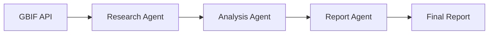

# Design Document

## Overview

The Wildlife Insight Agent is a Python application that implements a multi-agent system using the CrewAI framework to automate wildlife species research and reporting. The system follows a pipeline architecture where three specialized AI agents work sequentially to fetch, analyze, and report on biodiversity data from the GBIF API.

## Architecture

The system follows a linear pipeline architecture with three main components:



### Core Components

1. **CrewAI Framework**: Orchestrates the multi-agent workflow
2. **GBIF API Client**: Handles external API communication
3. **Agent Pipeline**: Sequential execution of specialized agents
4. **Data Flow**: Context passing between agents

## Components and Interfaces

### 1. Main Application (`main.py`)

**Purpose**: Entry point and orchestration of the CrewAI pipeline

**Key Functions**:
- `fetch_species_data(query: str) -> dict`: Helper function for GBIF API calls
- `main()`: Initializes agents, tasks, and executes the crew

**Dependencies**:
- `crewai` for agent framework
- `requests` for HTTP API calls

### 2. Research Agent

**Configuration**:
- Role: "Wildlife Researcher"
- Goal: "Fetch species data from the GBIF API"
- Backstory: "Expert in biodiversity datasets"

**Responsibilities**:
- Execute API calls to GBIF species search endpoint
- Handle API response and error cases
- Pass raw species data to the next agent

### 3. Analysis Agent

**Configuration**:
- Role: "Data Analyst"
- Goal: "Analyze species occurrence data and extract key insights"
- Backstory: "Finds endangered species and trends"

**Responsibilities**:
- Process raw GBIF API response data
- Extract occurrence counts and distribution information
- Identify conservation status indicators
- Generate structured insights for reporting

### 4. Report Agent

**Configuration**:
- Role: "Report Writer"
- Goal: "Summarize the analysis in simple, beginner-friendly language"
- Backstory: "Writes reports for students and conservationists"

**Responsibilities**:
- Transform technical analysis into accessible language
- Create structured, readable reports
- Focus on educational and conservation value

## Data Models

### API Response Structure
```python
# GBIF API Response (simplified)
{
    "results": [
        {
            "key": int,
            "scientificName": str,
            "canonicalName": str,
            "rank": str,
            "status": str,
            "confidence": int,
            "kingdom": str,
            "phylum": str,
            "class": str,
            "order": str,
            "family": str,
            "genus": str
        }
    ],
    "count": int,
    "endOfRecords": bool
}
```

### Task Context Flow
```python
# Task 1 Output (Research Agent)
{
    "api_response": dict,  # Raw GBIF response
    "query": str,          # Search query used
    "status": str          # Success/error status
}

# Task 2 Output (Analysis Agent)
{
    "species_count": int,
    "key_species": list,
    "conservation_insights": dict,
    "distribution_summary": str
}

# Task 3 Output (Report Agent)
{
    "final_report": str,   # Human-readable summary
    "key_findings": list   # Bullet points of insights
}
```

## Error Handling

### API Error Handling
- **Connection Errors**: Graceful fallback with informative messages
- **Rate Limiting**: Respect API limits and implement retry logic if needed
- **Invalid Responses**: Validate JSON structure and handle malformed data
- **Empty Results**: Handle cases where no species data is found

### Agent Error Handling
- **Task Failures**: Each agent should handle upstream failures gracefully
- **Context Validation**: Verify expected data structure from previous tasks
- **Fallback Responses**: Provide meaningful output even with incomplete data

### Implementation Strategy
```python
def fetch_species_data(query: str) -> dict:
    try:
        response = requests.get(f"https://api.gbif.org/v1/species/search?q={query}")
        response.raise_for_status()
        return response.json()
    except requests.RequestException as e:
        return {"error": str(e), "results": []}
```

## Testing Strategy

### Unit Testing
- **API Client Testing**: Mock GBIF API responses for consistent testing
- **Data Processing**: Test analysis logic with known data sets
- **Error Scenarios**: Verify graceful handling of various failure modes

### Integration Testing
- **Agent Pipeline**: Test complete workflow with real API calls
- **Context Passing**: Verify data flows correctly between agents
- **End-to-End**: Validate final report generation

### Manual Testing
- **API Connectivity**: Verify GBIF API accessibility
- **Report Quality**: Review generated reports for accuracy and readability
- **Different Species**: Test with various species queries

## Project Structure

```
wildlife_insight_agent/
├── main.py              # Main application entry point
├── requirements.txt     # Python dependencies
├── README.md           # Project documentation
└── .kiro/              # Kiro configuration
    └── specs/
        └── wildlife-insight-agent/
            ├── requirements.md
            ├── design.md
            └── tasks.md
```

## Dependencies

### Core Dependencies
- `crewai`: Multi-agent AI framework
- `requests`: HTTP client for API calls
- `matplotlib`: Data visualization (for potential future enhancements)

### Development Dependencies
- Standard Python libraries (json, sys, etc.)
- No additional testing frameworks required for initial implementation

## Configuration

### Environment Variables
- No environment variables required for basic functionality
- GBIF API is publicly accessible without authentication

### Default Settings
- Default species query: "tiger"
- API endpoint: `https://api.gbif.org/v1/species/search`
- Output format: Plain text report